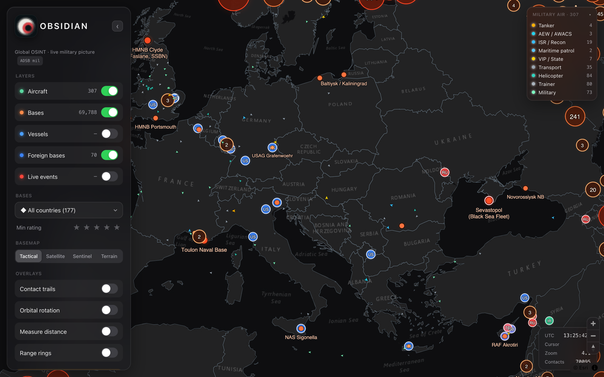
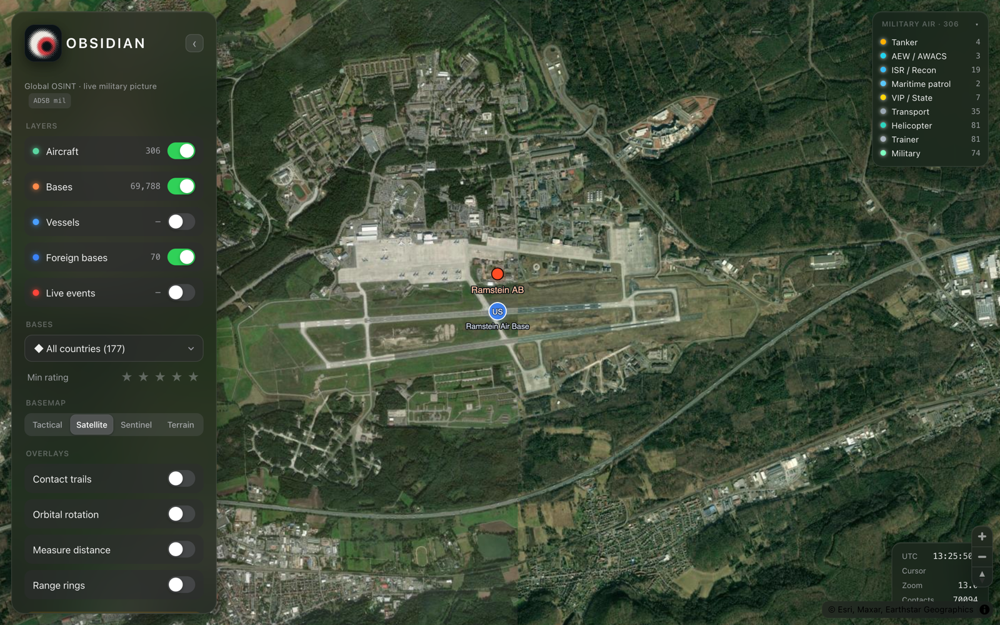
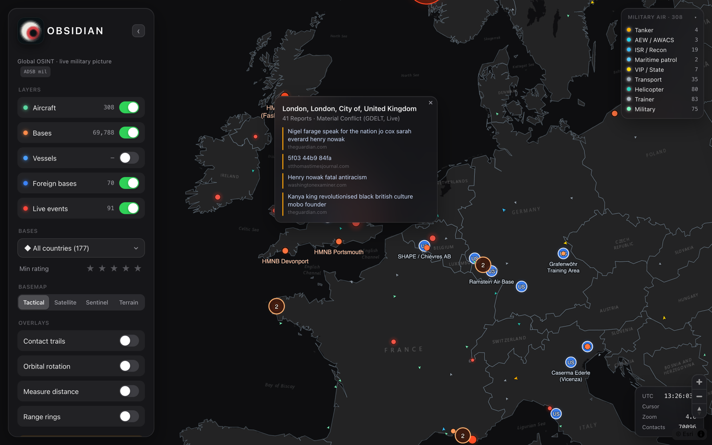

# OBSIDIAN

**Real-time OSINT military common-operating-picture on a 3D globe.**

OBSIDIAN fuses publicly broadcast, military-relevant signals — aircraft, vessels, installations, and live conflict events — into a single interactive globe. Every source is open and lawfully collected: the same class of data behind FlightRadar24, MarineTraffic, and ADSB-Exchange. It runs locally with no API keys.

<p align="center">
  
</p>

> Built by [Drexon Industries](https://drexonindustries.com). Node/Express backend, MapLibre GL JS frontend, no build step.

---

## Capabilities

| Layer | Source | What it delivers |
|---|---|---|
| **Military aircraft** | adsb.fi + airplanes.live `/mil` feeds, merged & deduped | Live ADS-B tracks classified by ICAO type code into 12 mission roles — tanker, AEW, ISR, fighter, bomber, transport, drone, VIP, C2, helo, patrol, trainer — each with a distinct symbol and live order-of-battle counts |
| **Installations** | OpenStreetMap (`military=*`, `landuse=military`) | ~70,000 sites, each attributed to a country via OSM-derived 1-metre borders. Selecting a base returns curated order-of-battle plus a live count of aircraft currently on the ground |
| **Overseas bases** | Curated dataset | 70 installations where the operating nation differs from the host country, colour-coded by operator |
| **Live conflict events** | GDELT 15-minute global event stream | Material-conflict hotspots aggregated by location. Each hotspot resolves to the underlying source news reporting, opened directly from the map |
| **Vessels** | aisstream.io (optional key) | Live AIS with military-ops traffic highlighted; falls back to a sample fleet when no key is present |

**Basemaps:** tactical (dark) · satellite (Esri / Maxar, sub-metre over developed areas) · Sentinel-2 cloudless (~10 m, keyless) · terrain.

---

## Interface

A tactical heads-up display designed for monitoring, not decoration:

- **Live order of battle** — per-role aircraft counts and a colour-keyed legend that update as contacts appear and drop.
- **Installation intelligence** — click any base for curated order-of-battle and live on-ground aircraft; overlay 100 / 250 / 500 / 1000 km range envelopes from any point.
- **Source attribution** — every conflict hotspot links straight to the news reporting behind it.
- **Analyst tooling** — contact trails, point-to-point distance measurement, country and significance filters, and one-click GeoJSON export of the current view.
- **Field-ready** — responsive layout that collapses to a drawer on mobile; auto-orbit for unattended display.

<p align="center">
  
  
</p>

---

## Run

```bash
git clone git@github.com:Divyonic/obsidian-osint.git
cd obsidian-osint
npm install
npm start                 # → http://localhost:8080
```

Aircraft, installations, overseas bases, and live conflict events all run with **zero API keys**. Optional keys extend coverage:

```bash
cp .env.example .env
```

| Key | Extends |
|---|---|
| `AISSTREAM_API_KEY` | Live AIS vessel layer ([free](https://aisstream.io)) |
| `ADSBX_API_KEY` | Authoritative ADSB-Exchange military feed (fallback) |
| `OPENSKY_CLIENT_ID` / `OPENSKY_CLIENT_SECRET` | Higher OpenSky rate limits (fallback feed) |

Requires Node 18+ (developed on Node 25). No bundler, no build step.

---

## Architecture

```
 Browser  (MapLibre GL JS · globe projection · tactical HUD)
    │   /api/aircraft   /api/bases   /api/events   /api/ships
    ▼
 Node / Express  ──►  adsb.fi + airplanes.live  /mil   (pull, merged & deduped)
                 ──►  GDELT 15-min event export        (pull → unzip → 10-min cache)
                 ──►  aisstream.io WebSocket            (persistent stream → in-memory)
                 ──►  static GeoJSON (bases, borders, overseas bases)
```

| Endpoint | Returns |
|---|---|
| `GET /api/aircraft` | Live military aircraft with per-role counts |
| `GET /api/bases?bbox=…` | OSM military installations for the viewport |
| `GET /api/events` | GDELT conflict hotspots with source-article links |
| `GET /api/ships` | Live AIS, or a sample fleet without a key |

### Engineering decisions worth knowing

- **Country attribution uses OSM-derived 1 m coastline borders, not Natural Earth.** Natural Earth disagrees with OSM at disputed frontiers — it places a Pakistani post roughly 17 km inside India, for instance. The build pipeline (`build_countries.mjs`) resolves 99.84% of installations via point-in-polygon plus coast-snapping.
- **Aircraft roles derive from ICAO type codes,** not callsign guessing.
- **GDELT's hosted GEO 2.0 API is dead (404).** OBSIDIAN instead pulls the raw 15-minute Events export (`lastupdate.txt` → `export.CSV.zip`), unzips it in-process, retains material-conflict records, and aggregates by location — recovering the underlying news URLs the hosted API never exposed.

### Regenerating the datasets

The runtime GeoJSON in `public/` is committed, so the app runs immediately after cloning. The heavy source data (`data/`, including a 106 MB OSM boundary file) is excluded from the repository — regenerate it with the build scripts:

```bash
node build_countries.mjs   # country borders + base attribution
node build_bases.mjs       # OSM installations → public/bases_global.geojson
node build_foreign.mjs     # curated overseas-base dataset
```

---

## Scope and honest limits

| Not provided | Reason |
|---|---|
| Real-time submarine tracking | A submerged submarine emits nothing trackable — that is the entire point of one. Open data shows only surfaced or in-port sightings. |
| Most drones | The majority of military UAVs do not broadcast ADS-B. Those that do appear in the aircraft layer like any other contact. |
| Warships running dark | Combatants routinely disable or spoof AIS. You see auxiliaries, logistics, and ships that choose to transmit — never a complete order of battle. |
| Personnel or weapon counts | Not open data. Base intelligence is limited to curated public order-of-battle and live on-ground aircraft. |

OBSIDIAN is deliberately scoped to what is real and verifiable from open sources. Any claim of a live, complete feed of every submarine and stealth asset on earth is a guess or a lie.

---

## License

MIT. Use responsibly and lawfully. All data sources are open and credited above.
